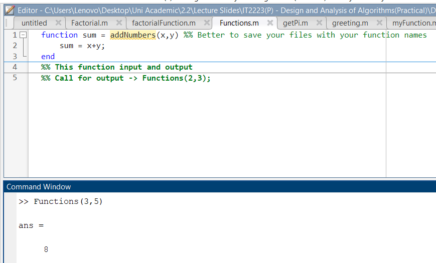
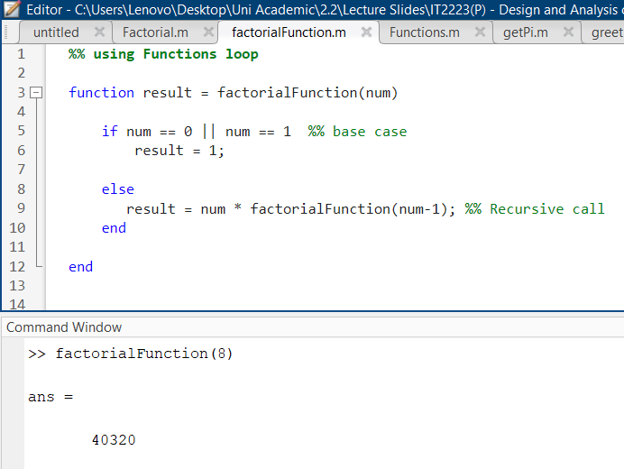
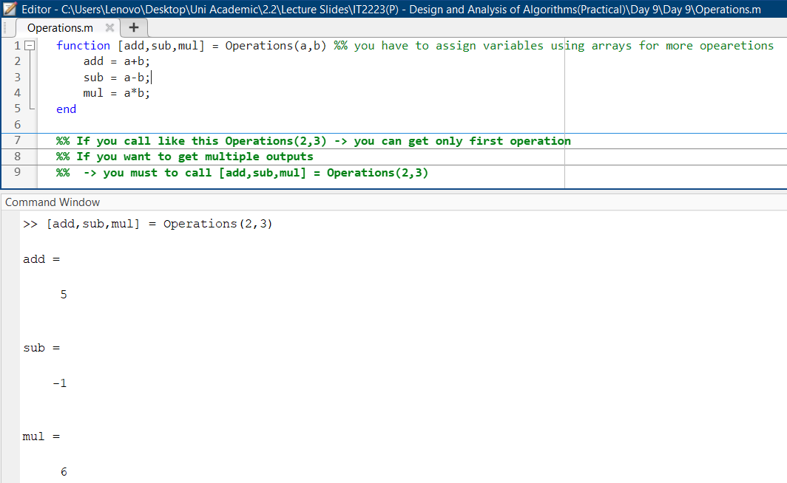
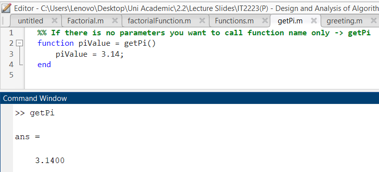
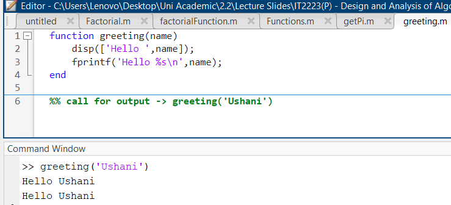
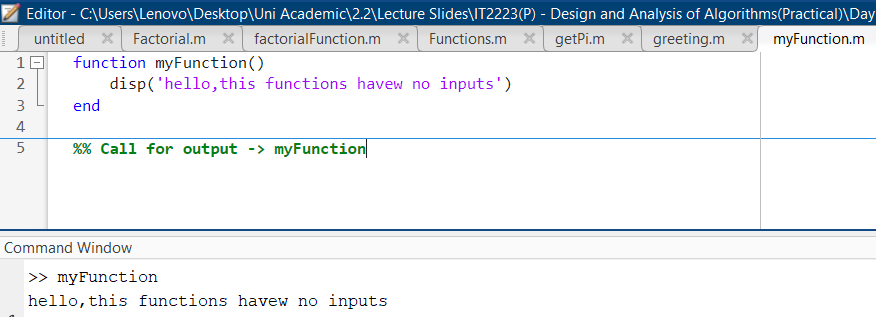

  | Codes | Output |
  |-------|--------|
  |['Functions.m'](./Functions.m)||
  |['factorialFunction.m'](./factorialFunction.m)||
  |['Operations.m'](./Operations.m)||
  |['getPi.m'](./getPi.m)||
  |['greeting.m'](./greeting.m)||
  |['myFunction.m'](./myFunction.m)||
