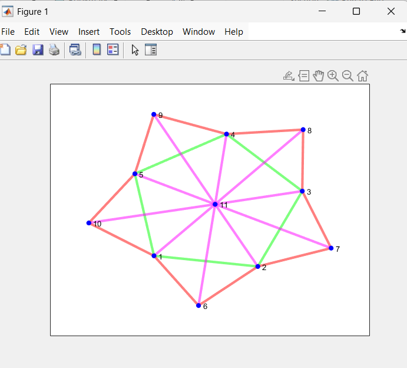

 | Codes | Output |
  |-------|--------|
  |['directedGraphs.m'](./Codes/directedGraphs.m)||
  |['undirectedGraphs.m'](./Codes/undirectedGraphs.m)||
  |['weightedUndirectedGraphs.m'](./Codes/weightedUndirectedGraphs.m)||
 |['adjacency.m'](./Codes/adjacency.m)| |
 |Before Using Force ||
 |After Using Force ||
 |['AdjecencyMatrix.m'](./Codes/AdjecencyMatrix.m)||
 |['colorNodes.m'](./Codes/colorNodes.m)||
 |['highlight.m'](./Codes/highlight.m)||
 |['nodeColor.m'](./Codes/nodeColor.m)||
 |['exercise.m'](./Codes/exercise.m)||
 |['tree.m'](./Codes/tree.m)||
 |['weighted_tree.m'](./Codes/weighted_tree.m)||
